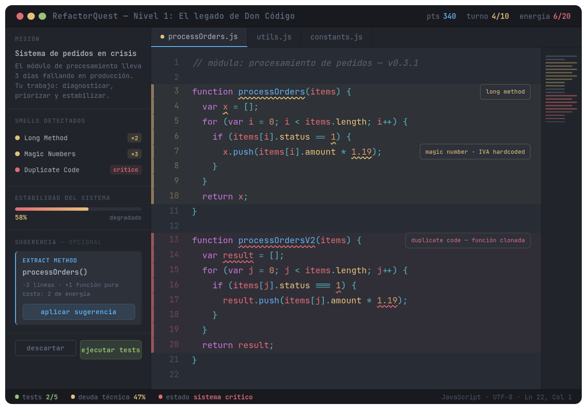
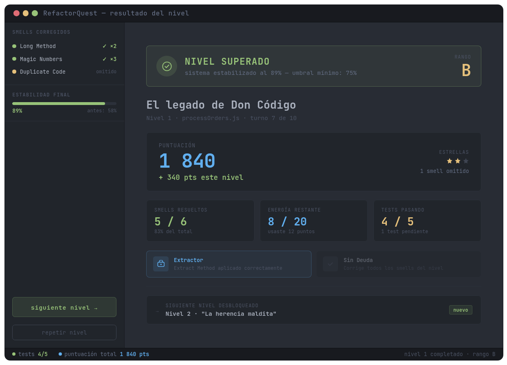

<p align="center">
  
</p>

# RefactorQuest

[](https://cesarfrr.github.io/refactor-quest/)

Juego serio (ABJ) para aprender refactorización de código. Proyecto final del curso *ABJ-d* — Universidad Nacional de Colombia, sede Bogotá.

El jugador asume el rol de un ingeniero forense que debe diagnosticar y corregir *code smells* en un sistema legacy, escribiendo código real en el editor Monaco (VS Code).

<p align="center">
  
</p>

<p align="center">
  <em>Wireframe de la interfaz del juego (tomado del reporte final)</em>
</p>

<p align="center">
  
</p>

<p align="center">
  <em>Pantalla de victoria al completar un nivel</em>
</p>

## Stack

| Componente | Tecnología |
|-----------|-----------|
| Lenguaje | JavaScript (ES6+) |
| Frontend | React 19 + TypeScript |
| Editor | Monaco Editor |
| Tema | One Dark Pro |
| Build | Vite 8 |
| Tests | Web Worker (sandbox) |

## Desarrollo

```bash
npm install
npm run dev
```

## Build

```bash
npm run build
npm run preview
```

## Enlaces

| Recurso | URL |
|---------|-----|
| Juego en vivo | https://cesarfrr.github.io/refactor-quest/ |
| Repositorio | https://github.com/CesarFRR/refactor-quest |
| Reporte final | `docs/RefactorQuest_Reporte_Final_crinconro.md` |

## Deploy (GitHub Pages)

```bash
npm run deploy
```

Configurar en GitHub: `Settings > Pages > Source: Deploy from a branch > gh-pages > / (root)`.

## Diseño (resumen)

El diseño sigue el marco LM-GM (Arnab et al., 2015) y los principios EDTF (Maxim, 2025). El *core loop* del juego es:

> Observar código → Diagnosticar smells → Refactorizar (editar) → Ejecutar tests → Feedback → (repetir)

El jugador pasa el 80% del tiempo en los pasos de Observar, Diagnosticar y Editar — todo ocurre en el mismo espacio (Monaco Editor).

### Mapeo LM–SGM–GM

| Learning Mechanic | Nivel Bloom | SGM | Game Mechanic |
|------------------|------------|-----|---------------|
| Observation | Analyze | Diagnosticar código | Feedback, Realism |
| Identify | Understand | Detectar code smells | Recognizing (*asistido visual*) |
| Hypothesis | Evaluate | Priorizar con recursos limitados | Resource Management (*energía*) |
| Action / Task | Apply | Escribir código real | Design / Editing |
| Feedback | transversal | Tests automáticos | Levels, Progression |
| Motivation | afectivo | Narrativa de "sistema en crisis" | Rewards / Status |

### Principios EDTF

- **Cognitiva**: panel ligero (~30%), sin popups modales
- **Afectiva**: tests fallidos sin penalización, sin GAME OVER
- **Física**: One Dark Pro, JetBrains Mono 15px, sin animaciones intrusivas

## Estructura del proyecto

```
src/
  levels/        ← Niveles en JSON (portables, generables por IA)
    level-0.json ← Nivel demo (Antes/Después, tutorial)
    level-1.json ← Magic numbers
    level-2.json ← Long method
    level-3.json ← Duplicate code
    level-4.json ← Data clump
    level-5.json ← Feature envy
    level-6.json ← Nivel final (integrador)
  utils/
    loadLevel.ts ← Descubre JSONs con import.meta.glob y los carga
    stars.ts     ← Sistema de estrellas (3/2/1) con persistencia localStorage
  components/    ← StartMenu, LevelSelect, SmellPanel, EditorPanel, LevelComplete
  hooks/         ← useGameState, useTestRunner
  data/          ← ASCII art compartido
  workers/       ← testRunner.worker.ts (sandbox para tests)
docs/            ← Reporte final, carátula, logo UNAL, capturas
```

## Autor

**César Fabián Rincón Robayo** — crinconro@unal.edu.co  
Curso ABJ-d, Universidad Nacional de Colombia, sede Bogotá

## Licencia

MIT
